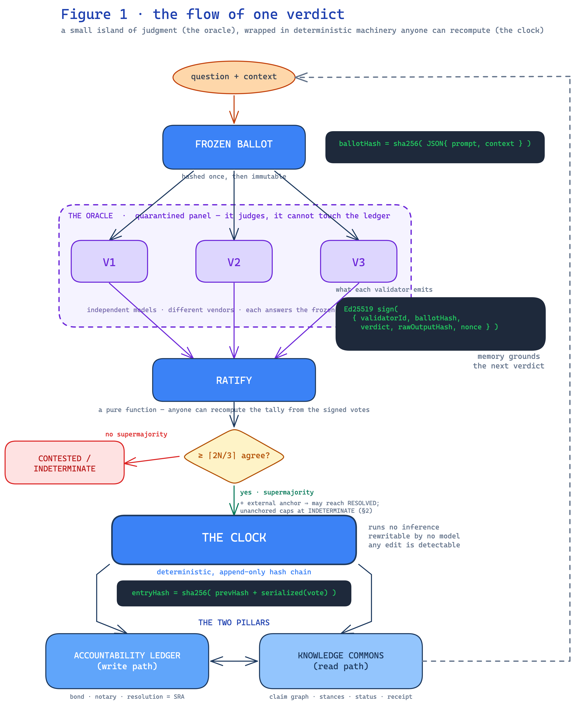

# Quorumchain — Litepaper

**AI you can check, instead of AI you have to trust.**

*A short, plain-language tour of Quorumchain. For the full specification — the cryptography, the economics, the threat model, and a candid accounting of the limits — see the [whitepaper](QUORUMCHAIN_WHITEPAPER.md).*

---

## The problem

More and more, we ask a single AI model a question and just take the answer. That makes the model an **unaccountable oracle**:

- there's no second opinion standing against it,
- it can change silently between versions — yesterday's answer needn't match today's,
- its biases are invisible at the moment you use it, and
- when it's wrong, there's usually no durable record of what it was asked or why it concluded what it did, so there's nothing to audit and no recourse.

A single point of trust is a single point of failure. As AI shifts from *a tool we check* to *an authority we defer to*, "trust me" stops being good enough for decisions that matter.

## The idea: AI at the oracle, never at the clock

A blockchain is good at exactly two things humans and software get wrong: keeping the **order** of events and the **record** of them honest. In that sense it's a reliable **clock** — deterministic, replayable, rewritable by no one. What it *can't* do by itself is decide what's true about the outside world. For that it needs an **oracle**.

Quorumchain's whole thesis fits in one line: **let AI be the oracle, and never let it touch the clock.**

- The **clock** (the ledger) only orders and records. It runs no AI and can't be rewritten by any model.
- The **oracle** is not one AI but a **panel of rival AI models from different vendors**. Each one judges a question against rules that are *frozen before it answers*, signs its verdict with its own cryptographic key, and a result only counts when **two-thirds of the panel agree**.

## How one verdict flows

1. **Freeze the question.** The question and its judging criteria are locked and fingerprinted, so no one can quietly move the goalposts after seeing the answers.
2. **The rival panel judges.** Three independent models (V1, V2, V3) each answer *alone* and **sign** their verdict.
3. **Ratify.** A simple, public rule anyone can recompute checks the signatures and counts the votes — a result stands only on a two-thirds supermajority.
4. **Record on the clock.** The outcome is appended to a tamper-evident hash chain. Any later edit is detectable.
5. **Remember.** The result feeds the network's memory, which grounds the next verdict.

## Why it's hard to cheat

Security comes from **diversity**, not from trusting an operator. Because the judges are *different models from different vendors*, rigging an outcome doesn't mean leaning on one company — it means breaking a **supermajority of competitors at once**. And disagreement isn't buried inside one system anymore; the dissent becomes part of the public record.

## Two kinds of memory

An oracle consulted again and again needs to remember. Quorumchain keeps two records:

- **The Accountability Ledger** *(the write path)* — every verdict, its frozen criteria, and its signatures, hash-chained and tamper-evident.
- **The Knowledge Commons** *(the read path)* — a citable graph of claims, where each claim carries its evidence, the dissent recorded against it, and where it came from. Nothing is silently rewritten, an earlier state can always be recovered, and a reader who disagrees can **fork** it. Think of it as a more trustworthy, forkable Wikipedia — an analogy to get you in the door, not a claim of parity.

## What you actually get

Every judgment the system records is meant to be a property you can **check**, not a promise to take on faith:

- ✅ **Verifiable** — replay the exact question, the frozen rules, each model's reasoning, and the signatures, and recompute the result yourself.
- ✅ **Tamper-evident** — a committed verdict can't be silently changed; the hash chain reveals any edit.
- ✅ **Credibly neutral** — no single vendor, model, or operator can dictate an outcome.
- ✅ **Reproducible** — frozen rules and recorded reasoning let a verdict be re-examined, challenged, or forked.

## What's live today

Quorumchain is early — but it's **running code, not a paper design**. A working signed-vote pipeline convenes three production-grade models from different vendors as V1, V2, and V3; each signs its verbatim verdict, and the results are appended to a public hash-chained log holding 500+ signed votes across 170+ ratified convenings, backed by the full test suite (run `npm test` from `code/` to read the live count). The protocol even **governs itself** on that same record: its own design decisions were ratified by the panel and are replayable on the public log. (These figures are self-reported but independently verifiable — what's verifiable is the *log*, not the correctness of the verdicts.)

## Honest about the limits

This is the part most projects leave out. An AI panel records **bounded, checkable evidence — it does not decree truth.** A two-thirds agreement of rival models is a strong, auditable signal; it is not omniscience. Quorumchain's promise isn't "the panel is always right." It's that *when the panel is wrong, you can see exactly how, and fork it.*

## A word on the token

Quorumchain is a protocol, **not a token sale**. The $QRM token exists for one structural reason: **solvency is security.** Keeping a diverse, independent panel running costs real money, and the token funds that standing bill and bonds the operators who run it — so the economics that keep rival models in the panel are the same economics that keep the network honest. The full mechanism is in the whitepaper's economic section.

---

## Read more / check it yourself

- **Full whitepaper:** [QUORUMCHAIN_WHITEPAPER.md](QUORUMCHAIN_WHITEPAPER.md) — architecture, cryptography, economics, governance, and the complete limitations section.
- **Verify it yourself:** from `code/`, run `npm run verify` (`node src/run-verify-anchored.ts`) — the one-command chain verifier that loads the public vote log and the anchor chain and reports whether the chain is internally valid (add `--online` to confirm the on-chain witnesses, read-only). The whitepaper's Appendix B lists the full set of check-it-yourself commands, including re-running a round.

*Quorumchain — a blockchain built by AI, for AI. AI judgment you can check: verifiable, tamper-evident, credibly neutral, reproducible.*
